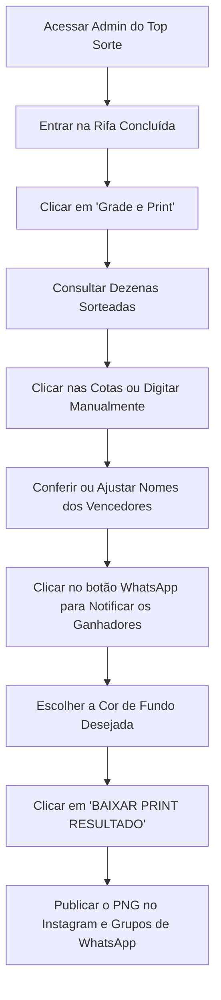

# 📸 Documento Oficial: Módulo Grade e Gerador de Print (Top Sorte 027)

**Sistema:** Top Sorte — Ganhe Prêmios Reais  
**Módulo:** Grade Interativa de Cotas e Gerador de Print de Resultados  
**Arquivo Fonte:** [`components/admin/RaffleGridView.tsx`](./components/admin/RaffleGridView.tsx)  
**Acesso:** Painel Administrativo (`/admin` ➔ Selecionar Sorteio ➔ **Grade e Print**)  

---

## 1. Visão Geral e Objetivo

O módulo **Grade e Print** foi desenvolvido para simplificar e profissionalizar a apuração e divulgação dos resultados dos sorteios do **Top Sorte 027**. 

Ele une duas funções essenciais em uma única tela:
1. **Conferência Visual da Grade:** Mapa completo e interativo de todas as cotas da rifa (pagas, pendentes e livres), permitindo identificar imediatamente quem comprou cada número.
2. **Gerador Automático de Print (Resultado Oficial):** Criação e exportação instantânea de uma imagem vertical em altíssima definição (formato ideal para WhatsApp Status, Instagram Stories e Feed) contendo os números sorteados, a premiação e os nomes dos ganhadores.

---

## 2. Como Acessar

1. Acesse o **Painel Administrativo** com a senha de administrador.
2. Na listagem de rifas, clique em **Gerenciar** na rifa correspondente.
3. No painel de controle (Dashboard), role até a seção **Ações Rápidas** e clique no card com o ícone de câmera:
   - **📸 Grade e Print** *(Marcar vencedor)*.

---

## 3. Elementos e Funcionalidades da Interface

### 3.1. Barra Superior de Controle
- **Botão "Baixar Print Resultado" (Verde):** Renderiza e baixa imediatamente o arquivo PNG em alta resolução (`DPR = 3`). Fica desabilitado até que pelo menos 1 ganhador seja selecionado.
- **Botão "Voltar" (Cinza):** Retorna com segurança para o painel principal da rifa.

---

### 3.2. Grade Interativa de Cotas
Exibe todas as cotas do concurso (ex: de `00` a `99` ou `000` a `999`):
- **Cota Cinza (Disponível):** Número livre não reservado.
- **Cota Azul (Paga):** Número pago e confirmado no banco de dados. Ao passar o mouse sobre o número, o tooltip exibe o nome do comprador cadastrado.
- **Cota Dourada / Destacada (Premiada):** Cota selecionada como vencedora de um dos prêmios, exibindo um badge com a medalha (🥇 1º, 🥈 2º, 🥉 3º, etc.) ou indicador `2x`/`3x` caso a mesma cota tenha sido premiada mais de uma vez.

---

### 3.3. Métodos para Definir Vencedores
O sistema oferece duas formas práticas e flexíveis:

1. **Clique Direto na Grade:**  
   Basta clicar em qualquer dezena da grade para adicioná-la à sequência de premiados. O primeiro clique define o **1º Prêmio**, o segundo define o **2º Prêmio**, o terceiro o **3º Prêmio**, e assim sucessivamente.
2. **Entrada Manual de Cota:**  
   Campo de texto *"Digitar Cota Manual / Repetida"* com botão `+ ADICIONAR PRÊMIO`.  
   - Aceita qualquer número (ex: digitar `7` preenche automaticamente `07` ou `007`).  
   - **Permite cotas repetidas:** se o mesmo participante faturou o 1º e o 2º prêmio, basta inserir ou clicar no número novamente.

---

### 3.4. Gestão e Sequência de Ganhadores (Tabela)
Para cada prêmio definido, é montada uma linha na tabela com as seguintes opções:
- **Card do Prêmio:** Exibe o número da cota e o selo da colocação (`🥇 1º Prêmio`, `🥈 2º Prêmio`, `🥉 3º Prêmio`...).
- **Campo de Nome Editável:** Inicializado automaticamente com o nome do comprador que consta no banco de dados. O administrador pode editar manualmente para abreviar, adicionar sobrenome ou colocar apelido público.
- **Botão "↩ Usar nome do banco":** Aparece sempre que o nome for alterado, permitindo restaurar o nome de cadastro original com um clique.
- **Link Direto para o WhatsApp do Ganhador:** Botão verde com o ícone do WhatsApp que abre diretamente uma conversa no aplicativo com a mensagem pronta personalizada:
  > *"Parabéns [Nome]! Você foi o ganhador do [1º Prêmio] no Top Sorte 027 com a cota #[Número]! 🎉🏆"*
- **Botão "✕ Remover":** Exclui a cota da lista de vencedores e recalcula automaticamente as posições dos prêmios subsequentes.

---

### 3.5. Personalização Visual do Print
Permite escolher a estética visual do cartão de resultado antes do download:
- **Paletas Pré-definidas de Alta Conversão:**
  - 🔵 **Azul Marinho Oficial** (`#001D3D`) — Identidade padrão do Top Sorte 027.
  - ⚫ **Preto Luxo** (`#0A0A0A`) — Visual elegante e sóbrio.
  - 🟣 **Roxo Sorte** (`#2E1065`) — Estilo vibrante e moderno.
  - 🟢 **Verde Esmeralda** (`#022C22`) — Tom alusivo a dinheiro e prosperidade.
  - 🔴 **Vinho Nobre** (`#450A0A`) — Tom premium.
  - 🟤 **Dourado Nobre** (`#451A03`) — Tom dourado escuro.
- **Paleta Customizada:** Seletor de cores nativo (Color Picker) para escolher livremente qualquer cor hexadecimal.

---

### 3.6. Prévia do Print em Tempo Real
Exibe no canto direito exatamente como a imagem final ficará:
- **Pílula de Marca:** `TOPSORTE_027` no topo.
- **Identificação do Concurso:** `RESULTADO OFICIAL - VENCEDORES DO CONCURSO #xxx`.
- **Cartões de Prêmio:**
  - Selo colorido da colocação (ex: `🥇 1º PRÊMIO`).
  - Badge destacado com a cota `#00`.
  - Nome do vencedor formatado em caixa alta com estilo itálico e tipografia ajustável (diminui automaticamente o tamanho da fonte caso o nome seja muito longo, evitando quebras visuais).
- **Rodapé Comemorativo:**
  - Linha dourada comemorativa.
  - Frases: *"PARABÉNS AOS GANHADORES!"* e *"OBRIGADO A TODOS POR PARTICIPAR"*.

---

## 4. Tecnologia de Geração do Print (Canvas 2D Ultra HD)

Diferente de capturas de tela comuns via navegador (que podem perder qualidade ou distorcer fontes em celulares), o gerador do Top Sorte utiliza **HTML5 Canvas 2D nativo**:

- **Resolução 3x (DPR = 3):** Gera a imagem com tripla densidade de pixels. O resultado é nítido mesmo ao dar zoom no WhatsApp ou Instagram.
- **Ajuste Dinâmico de Altura:** A imagem cresce verticalmente de forma harmoniosa conforme o número de prêmios adicionados (1 prêmio, 3 prêmios, 5 prêmios, etc.), mantendo proporções equilibradas.
- **Anti-quebra de texto:** O algoritmo de medição de texto (`ctx.measureText`) faz looping de decréscimo de fonte até garantir que nomes longos caibam perfeitamente no card.
- **Nome do Arquivo Padronizado:** O arquivo baixado segue a nomenclatura automática:  
  `ganhadores-top-sorte-[CODIGO_DO_CONCURSO].png`.

---

## 5. Roteiro Operacional Passo a Passo (Dia do Sorteio)

Quando a extração oficial ocorrer (ex: Loteria Federal ou sorteio ao vivo):

1. **Acesse a tela:** No Admin, abra a rifa e clique em **Grade e Print**.
2. **Defina os números:** Clique na cota do 1º prêmio, depois na do 2º prêmio e assim por diante.
3. **Valide os nomes:** Verifique se o nome puxado do banco está legível ou se necessita de ajuste.
4. **Comunique o vencedor:** Clique no botão de WhatsApp ao lado do nome para mandar a mensagem de parabéns instantânea.
5. **Baixe o Print:** Escolha a cor de fundo (ex: Azul Marinho ou Preto Luxo) e clique em **BAIXAR PRINT RESULTADO**.
6. **Divulgue:** O arquivo gerado estará na sua pasta de Downloads, pronto para postagem imediata.

---

## 6. Tabela de Estrutura de Cores e Estilos dos Prêmios

| Colocação | Ícone | Cor do Badge | Cor de Borda | Texto do Badge |
|---|:---:|:---:|:---:|:---:|
| **1º Prêmio** | 🥇 | Dourado (`#FDE68A` / `#FFD60A`) | Laranja Dourado (`#D97706`) | Azul Profundo (`#001D3D`) |
| **2º Prêmio** | 🥈 | Prata Metálica (`#E2E8F0`) | Cinza Ardósia (`#94A3B8`) | Azul Grafite (`#1e293b`) |
| **3º Prêmio** | 🥉 | Bronze Queimado (`#FED7AA`) | Laranja Queimado (`#EA580C`) | Branco (`#ffffff`) |
| **Demais Prêmios** | 🏅 | Grafite Neutro (`#334155`) | Cinza Médio (`#475569`) | Branco (`#ffffff`) |

---

## 7. Manutenção e Extensibilidade Técnica

- **Adicionar novos estilos de prêmio:** Atualizar os objetos `PRIZE_LABELS` e `PRIZE_PRINT_COLORS` em `components/admin/RaffleGridView.tsx`.
- **Modificar textos do print:** Localizados entre as linhas `170` e `295` da função `downloadScreenshot`.
- **Compatibilidade:** O gerador é 100% executado no lado do cliente (navegador do administrador), sem consumo de banda do servidor e compatível com computadores, notebooks e dispositivos móveis.
